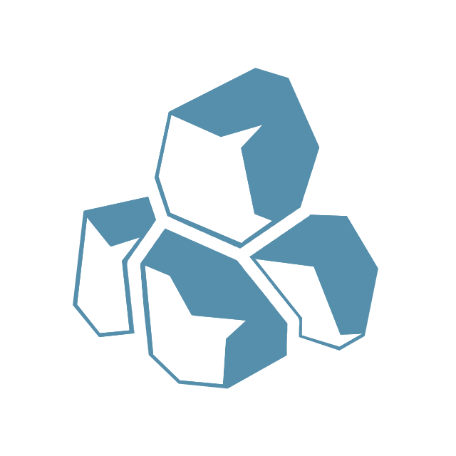

<h1 align="center">Obsidian Theme: Iron Alloy</h1>

   
  

    
    
    
  

  <small>Designed and coded with ❤️ & 🪲 by Krzysztof P. Gocek</small>
  <h3><i>Obsidian theme with a metallic taste!</i></h3>

 

  

 

  <b>Iron Alloy &copy; 2026</b>

 

